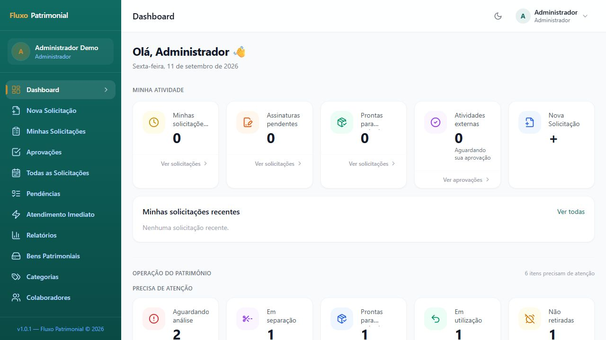
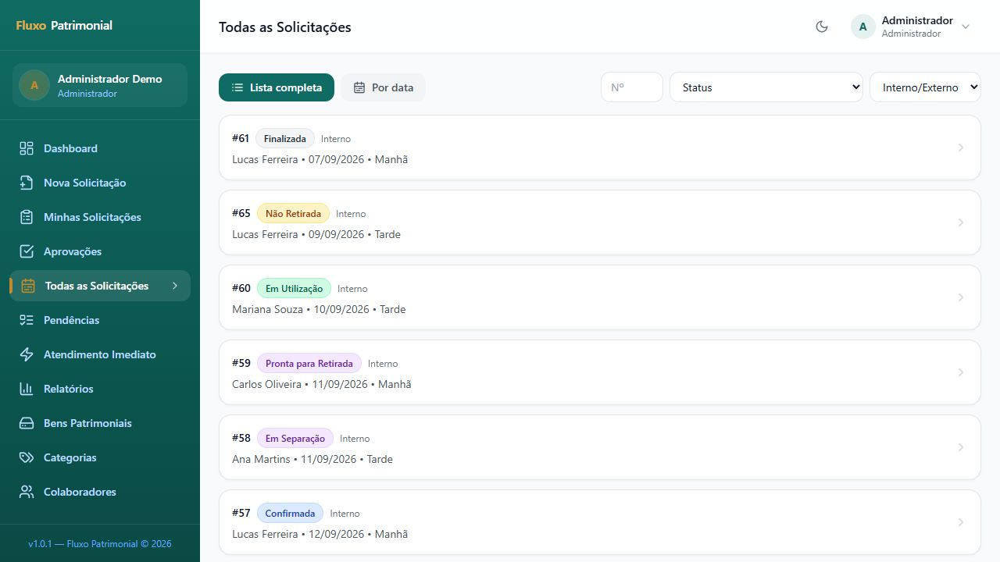
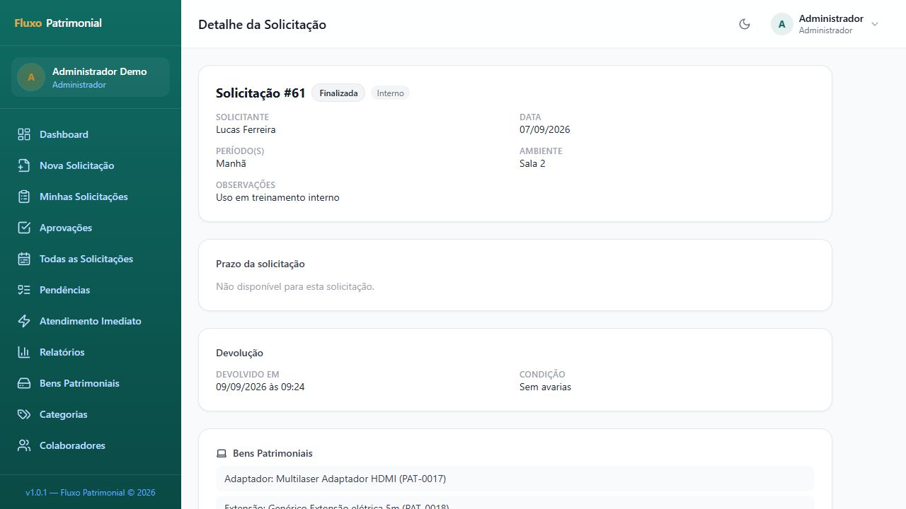
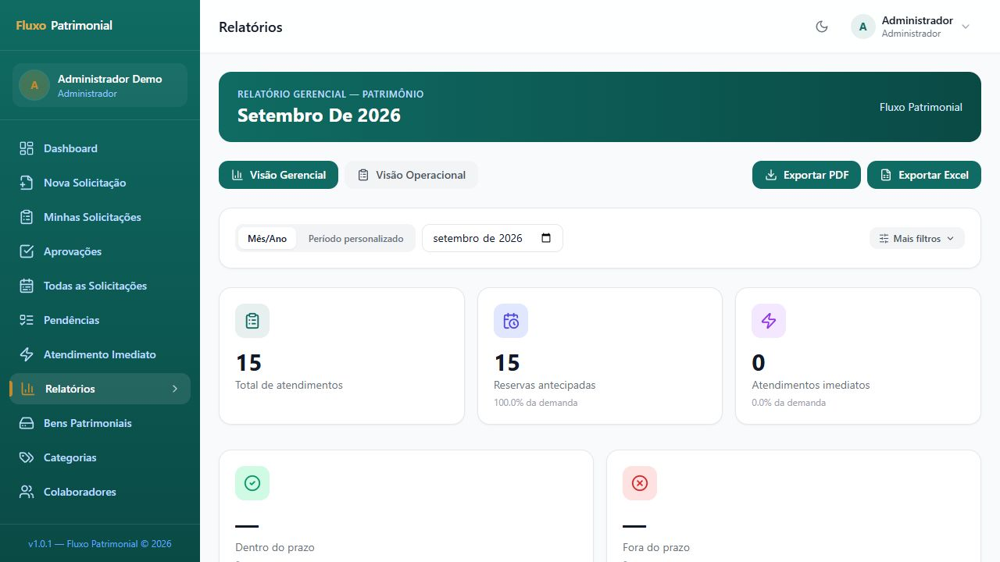
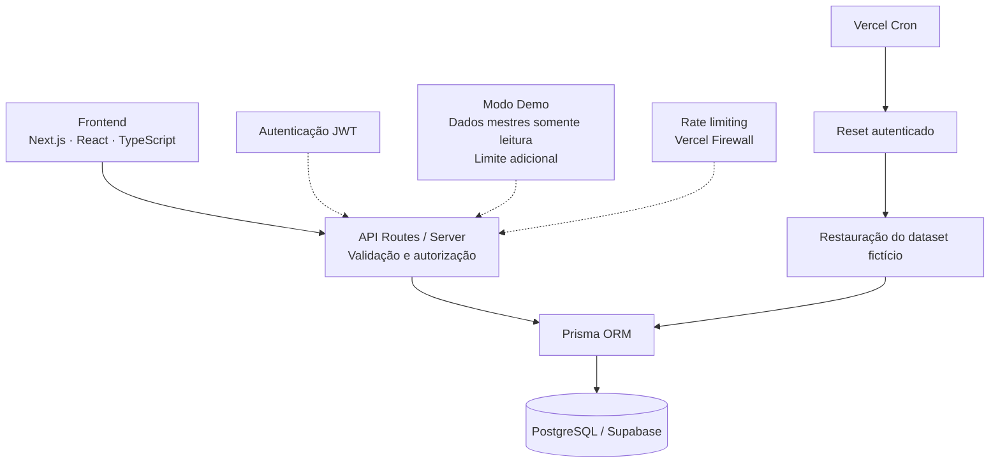

# Fluxo Patrimonial

**Gestão de ativos, reservas e empréstimos com rastreabilidade de ponta a ponta.**

Aplicação web para organizar solicitações, aprovações, retirada e devolução de ativos, com histórico operacional, permissões por perfil e relatórios.


### [Acessar demonstração →](https://fluxo-patrimonial-demo.vercel.app)

Use o botão **Acessar demonstração** na tela de entrada, sem informar credenciais.

> Demonstração com dados fictícios. Algumas ações administrativas são restritas para preservar a integridade do ambiente.



*Captura real da demonstração. Os dados e indicadores podem mudar entre visitas.*

[Funcionalidades](#principais-funcionalidades) · [Demo](#demo-pública) · [Arquitetura](#arquitetura) · [Setup](#setup-local) · [Documentação](#documentação)

## Visão geral

O Fluxo Patrimonial reúne o ciclo operacional de empréstimos em uma aplicação Full Stack: da solicitação ao encerramento, cada etapa tem responsáveis, permissões e histórico. Atende reservas internas, atividades externas e atendimentos imediatos, incluindo bens patrimoniais, materiais de papelaria e serviços.

O projeto demonstra implementação de workflows, autorização no servidor, persistência relacional, notificações e relatórios. A apresentação pública utiliza uma base demonstrativa fictícia.

## Principais funcionalidades

| Área | Recursos |
|---|---|
| Solicitações | Reservas internas e externas, múltiplos ativos, materiais e serviços |
| Aprovação | Gestor atribuído no fluxo externo e análise pela equipe de patrimônio |
| Operação | Separação, retirada, devolução com condição registrada e cancelamento |
| Assinatura | Envio de link e registro da confirmação; sem integração automática com plataforma externa |
| Rastreabilidade | Histórico de eventos e notificações internas |
| Gestão | Catálogo de bens, disponibilidade por data/período, usuários e permissões |
| Indicadores | Dashboard, relatórios gerenciais e operacionais, exportação Excel/PDF |
| Atendimento imediato | Registro de atendimentos sem reserva prévia |
| Demonstração | Acesso público, restrições administrativas e restauração periódica |

<details>
<summary>Ver capturas de solicitações e relatórios</summary>

### Solicitações



### Detalhes de uma solicitação



### Relatórios



</details>

## Demo pública

A [demonstração](https://fluxo-patrimonial-demo.vercel.app) usa banco separado e dados exclusivamente fictícios. O acesso automático utiliza uma conta demonstrativa compartilhada; alterações no fluxo podem ser vistas por outros visitantes e são descartadas no próximo reset.

- **Explore o workflow:** solicitações, aprovações, separação, retirada, devolução e relatórios.
- **Dados mestres protegidos:** colaboradores, bens e categorias podem ser consultados, mas suas alterações são bloqueadas no servidor. Autocadastro e troca de senha também ficam indisponíveis.
- **Sem e-mails externos:** o provedor `disabled` suprime o envio na demo.
- **Reset diário:** Vercel Cron restaura o dataset, com agendamento para 06:00 UTC, aproximadamente 03:00 em Brasília.
- **Proteção contra abuso:** Vercel Firewall limita a criação de solicitações na borda; há também limite adicional de 200 solicitações no ambiente.

As proteções reduzem abuso e acúmulo de dados; não representam garantia absoluta de disponibilidade ou integridade. [Detalhes e limites do modo Demo](docs/DEMO_MODE.md).

## Perfis de usuário

| Perfil ou capacidade | Responsabilidade |
|---|---|
| Colaborador | Criar e acompanhar as próprias solicitações |
| Gestor — capacidade adicional | Aprovar ou rejeitar solicitações externas atribuídas a ele |
| Patrimônio | Analisar solicitações e operar catálogo, separação, retirada e devolução |
| Administrador | Gestão operacional, usuários, categorias e permissões |

Gestor é uma capacidade adicional, não um quarto valor de perfil. Solicitar para outro colaborador também depende de capacidade específica. [Regras e permissões](docs/REGRAS_DE_NEGOCIO.md).

## Fluxos principais

| Fluxo | Caminho resumido |
|---|---|
| Interno | Solicitação → Patrimônio → Separação → Retirada → Devolução |
| Externo | Solicitação → Gestor → Patrimônio → Confirmação de assinatura → Separação → Retirada → Devolução |
| Atendimento imediato | Registro operacional → Em utilização, se houver bem → Devolução |

Atendimentos imediatos somente de materiais/serviços são finalizados no registro. Rejeições, cancelamentos e não retirada possuem estados próprios. [Diagramas completos](docs/FLUXOS.md).

## Arquitetura



Supabase fornece o PostgreSQL gerenciado. O acesso aos dados passa pelo backend e pelo Prisma; a autenticação é JWT própria, sem Supabase Auth.

O controle de acesso é executado no servidor. Mutações e determinadas leituras privilegiadas revalidam o usuário no banco; leituras comuns podem utilizar a sessão JWT. [Arquitetura detalhada](docs/ARQUITETURA.md).

## Stack

| Camada | Tecnologias |
|---|---|
| Aplicação | Next.js 15.5.24 · React 18.3.1 · TypeScript 5 |
| Interface | Tailwind CSS 3 · Radix UI · Lucide · Recharts |
| Formulários | React Hook Form · Zod |
| Persistência | Prisma 5 · PostgreSQL / Supabase |
| Autenticação | JWT com `jose` · `bcryptjs` |
| Comunicação | Resend no modo de envio real; provedor `disabled` na demo |
| Documentos | ExcelJS · `@react-pdf/renderer` |
| Hospedagem e proteção | Vercel · Vercel Cron · Vercel Firewall |

Versões e dependências em [package.json](package.json) e [package-lock.json](package-lock.json).

## Segurança

- JWT próprio em cookie `httpOnly`, `sameSite=lax` e `secure` em produção.
- Autorização no servidor e versionamento de sessão para revogação nas rotas que revalidam o usuário.
- Validação de entradas e de domínio de e-mail permitido. Configuração de domínio ausente ou inválida bloqueia novos cadastros (**fail-closed**).
- Secrets fornecidos por variáveis de ambiente; nenhum valor de credencial é necessário na documentação.
- Dados mestres somente leitura e envio externo de e-mail desabilitado na demo.
- Reset autenticado, com credenciais separadas para Vercel Cron e reset manual.
- Rate limiting integrado ao Vercel Firewall e limite adicional de solicitações na demo.

O helper de rate limiting do SDK adota **fail-open** em falhas de infraestrutura. Isso é distinto do fail-closed do domínio permitido e da autenticação do reset. [Controles e limitações](docs/DEMO_MODE.md#proteção-contra-abuso).

## Estrutura do projeto

```text
src/
├── app/          # Páginas e API Routes
├── components/   # Interface, layout e contexto de autenticação
├── hooks/        # Sessão, modo Demo e feedback
├── lib/          # Permissões, validações, e-mails, relatórios e dataset
├── types/        # Contratos TypeScript
└── utils/        # Datas, períodos e formatação
prisma/           # Schema, SQL consolidado e entrada do seed
scripts/          # Comandos de teste/validação e utilitário de reset
docs/             # Documentação técnica e capturas
```

## Setup local

Use uma instância PostgreSQL própria e vazia. A estrutura é criada a partir de [prisma/consolidated.sql](prisma/consolidated.sql); não há migração automática no build.

1. Instale uma versão LTS do Node.js compatível com as dependências e npm. O Next.js declarado aceita Node.js 18.18+; esse mínimo técnico não é recomendação de uma versão antiga.
2. Clone o repositório. Enquanto privado, o GitHub exige uma conta com acesso.
3. Copie o arquivo de exemplo para **`.env` na raiz** e preencha apenas com valores do seu ambiente local. O uso de `.env` permite o carregamento pelo Next.js e pelo Prisma utilizado no seed; `ts-node` não carrega `.env.local` automaticamente.

```bash
git clone https://github.com/almeidaxdev/fluxo-patrimonial.git
cd fluxo-patrimonial
cp .env.example .env
npm ci
```

No PowerShell, substitua o comando de cópia por `Copy-Item .env.example .env`.

4. Configure as conexões do banco, uma chave JWT forte, domínio permitido e URL local. Para explorar sem envio externo, use `EMAIL_PROVIDER=disabled`. [Guia de variáveis](docs/VARIAVEIS_AMBIENTE.md#configuração-local).
5. Aplique o SQL consolidado **somente no banco local/de desenvolvimento vazio escolhido**, pelo cliente SQL ou SQL Editor.
6. Execute o seed e inicie a aplicação:

```bash
npm run db:seed
npm run dev
```

Acesse [localhost:3000](http://localhost:3000). O seed imprime as senhas temporárias geradas para os novos usuários apenas no terminal. Não publique essa saída. O Prisma Client é gerado pelo `postinstall` durante a instalação.

[Modelo de dados e processo de criação](docs/BANCO_DE_DADOS.md) · [Configuração de ambiente](docs/VARIAVEIS_AMBIENTE.md)

## Testes

**56 comandos de teste e validação disponíveis no projeto**, implementados com `ts-node` e mocks em memória. Essa contagem é de comandos, não de casos unitários nem de cobertura.

Exemplos executáveis:

```bash
npm run test:session-jwt
npm run test:demo-mode-routes
npm run test:demo-reset-cron
npm run test:demo-dataset-reset
npm run build
```

Não há runner único `npm test`, medição de cobertura ou workflow de CI versionado. [Inventário completo e instruções](docs/TESTES.md).

## Documentação

Comece pelo [índice técnico](docs/README.md).

| Entender o produto | Entender a implementação |
|---|---|
| [Fluxos](docs/FLUXOS.md) | [Arquitetura](docs/ARQUITETURA.md) |
| [Perfis e regras](docs/REGRAS_DE_NEGOCIO.md) | [Banco de dados](docs/BANCO_DE_DADOS.md) |
| [Demo pública](docs/DEMO_MODE.md) | [Variáveis de ambiente](docs/VARIAVEIS_AMBIENTE.md) |
| [E-mails](docs/EMAILS.md) | [Testes](docs/TESTES.md) |
| [Manutenção](docs/MANUTENCAO.md) | [Deploy](docs/DEPLOY.md) |

## Roadmap

Direções de evolução, sem prazo de entrega definido:

- [ ] Melhorias de acessibilidade.
- [ ] Ampliação dos cenários de teste automatizados.
- [ ] Evolução da observabilidade.

## Autor

**Eduardo Almeida** · [almeidaxdev](https://github.com/almeidaxdev)

## Licença

Licença a definir.
