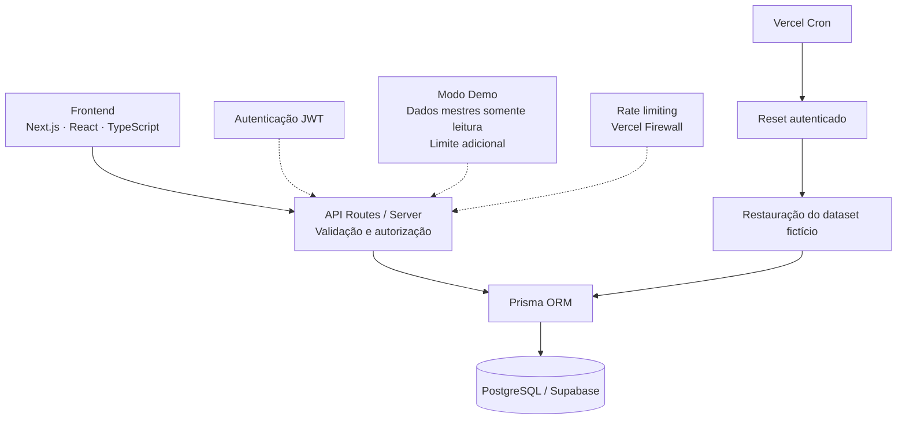

# Arquitetura — Fluxo Patrimonial

[← Documentação](README.md) · [Demo pública](DEMO_MODE.md)

## Visão da arquitetura



Supabase é usado como PostgreSQL gerenciado, sem Supabase Auth. JWT e autorização pertencem ao backend. As duas camadas de Firewall (borda e SDK), o limite adicional e o reset são detalhados em [Modo Demo](DEMO_MODE.md).

## Estrutura geral

```
src/
├── app/
│   ├── (auth)/              # Rotas públicas: login, cadastro
│   ├── (dashboard)/         # Rotas protegidas (todas passam por src/middleware.ts)
│   │   ├── lobby/
│   │   ├── nova-solicitacao/
│   │   ├── minhas-solicitacoes/
│   │   ├── todas-solicitacoes/
│   │   ├── pendencias/
│   │   ├── aprovacoes/
│   │   ├── atendimento-imediato/
│   │   ├── patrimonios/
│   │   ├── categorias/
│   │   ├── colaboradores/
│   │   ├── relatorios/
│   │   ├── solicitacoes/[id]/
│   │   ├── minha-conta/
│   │   └── alterar-senha/
│   └── api/                 # API Routes — ver seção abaixo
├── components/
│   ├── auth/                 # AuthProvider (revalidação client-side de sessão)
│   ├── layout/               # Sidebar, Header, DashboardShell
│   └── ui/                   # StatusBadge, ConfirmDialog, Switch, Toaster etc.
├── hooks/                    # use-session (repassa AuthProvider), use-toast
├── lib/
│   ├── prisma.ts             # Singleton do PrismaClient
│   ├── auth.ts                # JWT (assinatura/verificação de sessão)
│   ├── session-validation.ts   # getValidatedMutationSession() — revalidação server-side (S5)
│   ├── permissions.ts         # isPatrimonioOuAdmin / isAdmin / podeAtuarComoGestor
│   ├── status.ts               # Máquina de transições de status da Solicitação
│   ├── prazo.ts                 # Cálculo de antecedência/prazo (48h/72h)
│   ├── validations.ts            # Schemas Zod (inclui emailPermitidoSchema/nomeColaboradorSchema)
│   ├── historico.ts / notificacoes.ts  # Helpers de escrita dentro de transaction
│   ├── relatorios.ts               # Agregações dos relatórios
│   ├── relatorios-auth.ts            # Guarda de autorização própria dos relatórios (revalida no banco)
│   ├── rate-limit.ts                  # checkSensitiveRateLimit() (S4)
│   └── email/                       # Infraestrutura de e-mail (ver docs/EMAILS.md)
├── middleware.ts               # Proteção de rota por sessão/permissão
└── types/                       # Tipos TypeScript compartilhados
prisma/
├── schema.prisma
├── consolidated.sql
├── seed.ts
└── migrations/
```

## Frontend

- Next.js App Router; a maioria das páginas de `(dashboard)/` é `'use client'` (formulários com estado local, listas com filtro/paginação client-driven contra API própria).
- Sem Server Components buscando dados diretamente do Prisma nas páginas — todo acesso a dado passa por uma API Route (`fetch` do client component), nunca um `import { prisma }` dentro de um componente de página.
- TailwindCSS para estilização, com tokens de cor próprios do Fluxo Patrimonial.
- Formulários usam React Hook Form + Zod (cadastro/login) ou estado local controlado (wizard de Nova Solicitação, telas administrativas).

## Backend

- Toda a lógica de negócio vive em API Routes (`src/app/api/**/route.ts`) — Next.js Route Handlers, rodando como funções serverless na Vercel.
- Cada rota valida sessão e permissão no próprio handler — nunca confia apenas na proteção de página do middleware. Rotas de **mutação** (POST/PATCH/DELETE de negócio) usam `getValidatedMutationSession()` (reconsulta o banco a cada chamada); GETs comuns usam só `getSession()` (JWT, sem consulta ao banco) — ver seção "Revogação de sessão" abaixo para o racional completo.
- Transições de status passam sempre por `podeTransitar()`/`TRANSICOES_PERMITIDAS` (`src/lib/status.ts`) — nenhuma rota compara/atribui status livremente.

## API Routes

Agrupadas por domínio (não é uma cópia de código — só finalidade, autenticação e efeitos principais):

### Autenticação (`/api/auth/**`)
- `POST /login`, `POST /logout`, `POST /cadastro` — rotas públicas de autenticação (junto com as páginas `(auth)/`). A demo também expõe status/entrada, e o reset utiliza autenticação própria por secret. `login` normaliza (trim + lowercase) o e-mail antes do rate limit e da consulta ao banco (Etapa `fix/collaborator-session-sync`). `cadastro` cria sempre com `permissao: 'colaborador'` (sem caminho de auto-elevação) e só aceita e-mail de domínio permitido (`@example.com`, `emailPermitidoSchema`).
- `GET /me` — **revalida no banco** (`getValidatedMutationSession()`, Etapa `fix/collaborator-session-sync`) — diferente de `logout` (não revalida, não precisa). Fonte de verdade dos dados ATUAIS da conta para o frontend (`AuthProvider`) — ver "Revogação de sessão".
- `PATCH /senha` — troca da própria senha. Revalida a sessão (reaproveitando a própria query que já precisa do hash atual, sem uma segunda consulta) e **incrementa `versaoSessao`** do próprio usuário, encerrando a sessão atual (cookie limpo, força novo login) — ver "Revogação de sessão".

### Solicitações (`/api/solicitacoes/**`)
- `GET /` — listagem paginada (`escopo=minhas|todas|gestor`), usada por Todas/Minhas Solicitações, Pendências e Aprovações. `escopo=minhas`/`gestor` usam só `getSession()`. `escopo=todas` (Patrimônio/Admin, expõe solicitações de TODOS os usuários) **revalida no banco** (`getValidatedMutationSession()`) — só esse ramo, os outros dois continuam sem round-trip extra. Ver "Revogação de sessão".
- `POST /` — cria a solicitação (interna, externa ou atendimento imediato), dentro de uma única transaction (ver seção Transactions). `solicitanteId` (opcional no payload — se ausente, usa o próprio usuário autenticado) só pode ser diferente de `session.id` para Gestor/Patrimônio/Administrador, ou para um colaborador com a capacidade individual `podeSolicitarParaOutro = true` (`podeSolicitarParaOutro()`, `src/lib/permissions.ts` — decidido só pelas claims do JWT, nunca por um valor do body); colaborador comum recebe `403` — ver `docs/REGRAS_DE_NEGOCIO.md`, seção "Solicitar para outro colaborador".
- `GET /[id]` — detalhe completo (única rota que traz todas as relações).
- `POST /[id]/aprovar-gestor`, `/rejeitar-gestor` — exclusivas do gestor atribuído.
- `POST /[id]/confirmar-patrimonio`, `/rejeitar-patrimonio` — exclusivas de Patrimônio/Administrador.
- `POST /[id]/assinatura`, `/assinatura/confirmar` — envio/reenvio de link e confirmação (fluxo externo).
- `POST /[id]/separacao`, `/retirada`, `/devolucao`, `/nao-retirada` — etapas operacionais, exclusivas de Patrimônio/Administrador.
- `POST /[id]/cancelar` — solicitante ou Patrimônio/Administrador, condicionado ao status atual.

### Patrimônios e categorias
- `GET/POST /api/patrimonios`, `PATCH/DELETE /api/patrimonios/[id]` — CRUD, exclusivo de Patrimônio/Administrador. `GET` (rota inteira, sem ramo comum) **revalida no banco** (`getValidatedMutationSession()`) por expor o inventário completo — ver "Revogação de sessão".
- `GET /api/patrimonios/disponibilidade` — bens livres por categoria/data/período (ou modo `imediato`).
- `GET/POST /api/categorias`, `PATCH/DELETE /api/categorias/[id]` — leitura liberada a qualquer autenticado; escrita exclusiva de Administrador.
- `GET /api/tipos-servico` — catálogo de serviços/movimentações.

### Colaboradores e gestores
- `GET/POST /api/colaboradores`, `PATCH/DELETE /api/colaboradores/[id]` — exclusivo de Administrador (inclui redefinição de senha temporária, edição de nome/e-mail e ativação/desativação de conta — Etapa `fix/collaborator-session-sync`). Todas as quatro **revalidam no banco** (`getValidatedMutationSession()`) — `GET` por expor `permissao`/`ativo`/`podeSolicitarParaOutro` de todos os colaboradores; `PATCH` é também a rota que **incrementa `versaoSessao`** do usuário ALVO (não do admin que chama) quando `email`/`permissao`/`ativo`/`podeSerGestor`/`podeSolicitarParaOutro` mudam de valor, ou quando `resetSenha: true` — ver "Revogação de sessão". `POST`/`PATCH` só aceitam e-mail de domínio permitido (mesmo `emailPermitidoSchema` do cadastro); `PATCH` bloqueia `ativo: false` na própria conta do admin autenticado (`400`, validado no backend, não só no frontend).
- `GET /api/colaboradores/busca` — busca por nome/e-mail (usada no wizard de Nova Solicitação e Atendimento Imediato).
- `GET /api/gestores` — usuários ativos com `podeSerGestor = true`.

### Dashboard e notificações
- `GET /api/dashboard` — contagens/indicadores por perfil, resolvidas em um único `Promise.all`.
- `GET /api/notificacoes`, `PATCH /api/notificacoes/[id]`, `POST /api/notificacoes/marcar-todas-lidas`.

### Relatórios
- `GET /api/relatorios/resumo` — visão gerencial (agregações via `groupBy`/`count`).
- `GET /api/relatorios/operacional` — tabela paginada e filtrável.
- `GET /api/relatorios/excel`, `GET /api/relatorios/pdf` — exportações. Todas exigem `autorizarRelatorios()` (`src/lib/relatorios-auth.ts`), que **reconsulta o usuário no banco a cada chamada** (não confia só no JWT) — revoga acesso imediatamente se o usuário for desativado/perder a permissão. Precede a etapa `security/session-revocation` e usa seu próprio caminho de revalidação (`ativo`+`permissao` frescos do banco), sem depender de `versaoSessao` — ver seção "Revogação de sessão" abaixo.

## Prisma

Singleton em `src/lib/prisma.ts`, reutilizado via `globalThis` em desenvolvimento (evita múltiplas instâncias durante hot-reload) — nenhuma rota faz `new PrismaClient()`. `log` habilitado (`query`, `error`, `warn`) apenas fora de produção.

## Supabase

Usado exclusivamente como **PostgreSQL gerenciado** — a aplicação não usa o cliente `supabase-js`; todo acesso passa pelo Prisma, com a connection string de servidor (não a `anon key`). `DATABASE_URL` aponta para o pooler Supavisor em modo transação (porta 6543, `pgbouncer=true`); `DIRECT_URL` para o pooler em modo sessão (porta 5432), usado por operações que precisam de conexão persistente (ex.: `prisma generate`/introspecção).

**Data API (PostgREST/GraphQL): não utilizada pela aplicação.** A documentação original registra a opção de mantê-la desabilitada no ambiente; esse estado depende do painel, não é imposto pelo repositório. Auditoria confirmou que a aplicação não usa, em nenhum ponto do código: `@supabase/supabase-js`, a Data API REST (`/rest/v1`) ou GraphQL (`/graphql/v1`), Supabase Auth, Storage, Realtime ou Edge Functions — todo o acesso a dado é `Browser → Next.js → API Routes (server) → Prisma → Postgres via Supavisor`, um protocolo de banco nativo, nunca HTTP/REST. Prisma não depende da Data API: a conexão utiliza `DATABASE_URL`/`DIRECT_URL`. Qualquer exposição futura via Data API exige revisão própria de grants e policies; o uso do Prisma não comprova por si só a configuração externa de acesso.

**RLS (Row Level Security) não é o mecanismo de autorização desta aplicação.** Toda autorização acontece no backend Next.js, a partir do JWT próprio (ver seção "Autenticação" abaixo e `src/lib/permissions.ts`) — nunca de policies de banco. Isso é intencional e coerente com a Data API desabilitada: como a conexão do Prisma usa a role de servidor (`postgres`, com acesso pleno — não `anon`/`authenticated`), RLS não afeta o Prisma mesmo que fosse habilitado. Se a Data API for reativada no futuro por algum motivo, **RLS e grants explícitos precisam ser desenhados e aplicados a cada tabela ANTES dela ser exposta** — reativar a Data API só para contornar outra configuração, sem esse desenho, reabriria o vetor descrito acima.

## Vercel

Deploy automático a partir de `main`; funções serverless para as API Routes; `postinstall: prisma generate` garante o Client atualizado a cada build, sem depender de um passo manual. Região das funções não está fixada no código (`next.config.js` não declara `region`) — configurada no painel do projeto.

## E-mails

Há dois provedores: Resend para envio real e `disabled` para supressão de envio na demo. Ver [E-mails](EMAILS.md) para o pipeline completo. Resumo: `src/lib/email/send-email.ts` é o único ponto de saída para o provedor; nunca lança exceção (sempre retorna `{ success: boolean, ... }`), para que uma falha de e-mail nunca comprometa a transação de negócio que o originou.

## Security headers

`next.config.js` (`headers()`) aplica, a **todas** as rotas (páginas e API): `X-Content-Type-Options: nosniff`, `Referrer-Policy: strict-origin-when-cross-origin`, `X-Frame-Options: DENY` e `Permissions-Policy` bloqueando câmera, microfone, geolocalização, pagamento, USB, fullscreen e Clipboard API (nenhum é usado em nenhuma tela — confirmado por auditoria). `Strict-Transport-Security: max-age=31536000; includeSubDomains` (sem `preload`) é adicionado só quando `NODE_ENV === 'production'`. **Sem `Content-Security-Policy` nesta etapa** — decisão deliberada: o `ThemeProvider` (`next-themes`) injeta um script inline no `<head>` para evitar flash de tema errado antes da hidratação, o que quebraria um `script-src` estrito sem a infraestrutura de `nonce` (inexistente hoje); e não há endpoint de `report-uri`/`report-to` configurado para validar uma policy em modo `Report-Only` sem ruído. Ver `docs/MANUTENCAO.md` para o plano futuro de CSP.

## Rate limiting

A demo pública tem uma regra de borda do Vercel Firewall para `POST /api/solicitacoes`: **10 requisições / 60 segundos / IP**, conforme validação do mantenedor em 11/09/2026.

Separadamente, [src/lib/rate-limit.ts](../src/lib/rate-limit.ts) utiliza `@vercel/firewall`, com o Rate Limit ID `fluxo-patrimonial-sensitive-actions`. O código separa ações por namespace e identificador normalizado com hash SHA-256.

| Ação | Identificador do helper |
|---|---|
| Login | E-mail normalizado |
| Cadastro | IP |
| Envio/reenvio de link de assinatura | Solicitação e usuário |
| Entrada na demo | IP |
| Reset manual | IP |
| Criação de solicitações na demo | Usuário autenticado |

A regra correspondente ao SDK é configurada no painel; os parâmetros documentados para ela são 8 requisições em 600 segundos. A confirmação da regra de borda de 10/60 não confirma essa configuração adicional.

Em exceções de infraestrutura, o helper retorna `limited: false` (**fail-open**); um bloqueio retornado pelo SDK é respeitado. A regra de domínio permitido, já implementada em `validations.ts`, é um controle diferente e adota fail-closed na ausência de configuração válida.

A demo também verifica `DEMO_MAX_SOLICITACOES` antes da criação, independentemente do Firewall, e restaura o dataset por Vercel Cron. Consulte [proteção contra abuso](DEMO_MODE.md#proteção-contra-abuso) para cobertura, limitações de concorrência e separação entre as camadas.

## Autenticação

```
Login (POST /api/auth/login)
  → valida credenciais (bcrypt.compare)
  → signToken() (jose, HS256) com claims de SessionUser
    (id, nome, email, permissao, podeSerGestor, podeSolicitarParaOutro, versaoSessao)
  → cookie httpOnly "session" (24h — Etapa security/session-revocation, era 7 dias)

Requisição subsequente
  → src/middleware.ts lê o cookie, verifica SÓ assinatura/expiração do JWT (verifyToken(),
    sem Prisma, sem tocar o banco)
  → sem token/inválido: redireciona /login (página) ou 401 JSON (API)
  → com token válido: libera acesso à rota pública ou aplica gate de página por perfil
    (PATRIMONIO_ROUTES / ADMIN_ROUTES / GESTOR_ROUTES) — usando as claims do
    próprio JWT, potencialmente desatualizadas (ver "Revogação de sessão")
  → cada API Route SEMPRE valida sessão + permissão no próprio handler
    (o middleware nunca é a única linha de defesa para rotas de API):
    mutações de negócio usam getValidatedMutationSession() (reconsulta o
    banco); GETs comuns usam só getSession() (JWT)
```

`JWT_SECRET` é validado em runtime (mínimo 32 caracteres) — sem fallback inseguro; a lib falha explicitamente se ausente/fraca, só quando o token é de fato assinado/verificado (nunca no escopo do módulo, para não quebrar o build).

## Revogação de sessão (Etapa security/session-revocation)

O JWT é autocontido: por padrão, uma vez emitido, ele continua válido até expirar, mesmo que o usuário seja desativado, tenha a senha resetada ou perca uma permissão — não existe "invalidar um token" isoladamente num esquema JWT sem estado. Esta etapa fecha essa lacuna para as ações que importam (mutações de negócio) através de um contador de versão por usuário, sem introduzir uma tabela de sessões nem trocar o modelo (continua stateless para leitura comum).

### `versaoSessao` — o mecanismo

- `User.versaoSessao` (`Int @default(0)`) — contador incrementado sempre que uma mudança de segurança relevante acontece **no usuário alvo**: troca de senha (própria ou reset administrativo), `ativo` muda de valor (em qualquer direção — desativar OU reativar), `permissao` muda de valor, `podeSerGestor` muda de valor, `podeSolicitarParaOutro` muda de valor.
- O JWT carrega a `versaoSessao` vigente **no momento do login** (`src/app/api/auth/login/route.ts`), como qualquer outra claim — nunca recalculada sem um novo login.
- `getValidatedMutationSession()` (`src/lib/session-validation.ts`) é chamada pelas rotas de mutação (ver lista abaixo). Ela reconsulta o usuário no banco **a cada chamada** (1 única query) e compara, com `===` estrito, a `versaoSessao` do banco contra a claim do token. Qualquer divergência — ou o usuário não existir mais, ou `ativo === false` — invalida a sessão imediatamente com `401`, mesmo que o JWT ainda tenha até 24h de vida.
- A MESMA query já devolve `permissao`/`podeSerGestor`/`podeSolicitarParaOutro` **atuais** — uma rota de mutação nunca precisa de uma segunda consulta só para autorizar: `isPatrimonioOuAdmin()`/`isAdmin()`/`podeAtuarComoGestor()`/`podeSolicitarParaOutro()` (`src/lib/permissions.ts`) sempre recebem o usuário devolvido por `getValidatedMutationSession()`, nunca a `session`/claims brutas do JWT, a partir do ponto em que a sessão foi revalidada.
- Resposta padronizada (`respostaSessaoInvalida()`): sempre `401` com a mesma mensagem genérica ("Sessão inválida ou expirada. Faça login novamente.") e sempre limpa o cookie `session` — nunca revela qual foi o motivo real (usuário removido, desativado, versão divergente, token pré-etapa sem a claim), para não permitir enumeração/fingerprinting pelo cliente.

### Token antigo sem a claim `versaoSessao` (emitido antes desta etapa)

Um token assinado antes desta etapa nunca teve essa claim no payload — `typeof session.versaoSessao !== 'number'` é sempre verdadeiro para ele. `getValidatedMutationSession()` checa exatamente isso **antes** de qualquer consulta ao banco e rejeita — **deliberadamente sem nenhum fallback `?? 0`**: tratar a ausência da claim como `0` deixaria passar um usuário que nunca teve a versão incrementada. Resultado prático: qualquer sessão anterior a este deploy é forçada a um novo login na primeira mutação que tentar fazer após o deploy, mesmo sem nenhuma mudança de segurança ter ocorrido nela. Coberto por `scripts/test-session-jwt.ts` (item C) e `scripts/test-session-revalidation.ts` (item B).

### O que É revalidado (mutações) vs. o que NÃO é (GETs comuns)

**Revalidam no banco** (`getValidatedMutationSession()`), sempre nesta ordem — sessão válida primeiro, depois permissão sobre o usuário fresco devolvido:

- Todas as rotas de mutação de `Solicitacao` (`POST /api/solicitacoes`, `.../aprovar-gestor`, `.../rejeitar-gestor`, `.../confirmar-patrimonio`, `.../rejeitar-patrimonio`, `.../assinatura`, `.../assinatura/confirmar`, `.../cancelar`, `.../separacao`, `.../retirada`, `.../devolucao`, `.../nao-retirada`).
- `POST/PATCH/DELETE /api/colaboradores`, `/api/colaboradores/[id]` — inclui o `GET` (lista dados de todos os colaboradores).
- `POST/PATCH/DELETE /api/categorias`, `/api/categorias/[id]`; `POST/PATCH/DELETE /api/patrimonios`, `/api/patrimonios/[id]` — inclui o `GET` de `/api/patrimonios` (inventário completo, rota inteira exclusiva de Patrimônio/Admin).
- `PATCH /api/notificacoes/[id]`, `POST /api/notificacoes/marcar-todas-lidas`.
- `PATCH /api/auth/senha` — reaproveita a própria query que já precisa do hash da senha atual (nunca uma segunda consulta redundante); ver `respostaSessaoInvalida()`, exportada exatamente para esse caso.
- `GET /api/solicitacoes` **somente no ramo `escopo=todas`** (expõe solicitações de TODOS os usuários) — `escopo=minhas`/`gestor` continuam sem revalidar.
- `GET /api/relatorios/resumo`, `/operacional`, `/excel`, `/pdf` — via `autorizarRelatorios()` (`src/lib/relatorios-auth.ts`), que reconsulta `ativo`+`permissao` a cada chamada por caminho próprio, sem depender de `versaoSessao` (ver seção "Relatórios" em API Routes, acima, para o racional completo).

**NÃO revalidam** (só `getSession()`, JWT, sem tocar o banco) — decisão deliberada de performance, não uma lacuna esquecida:

- `GET /api/dashboard`, `/api/notificacoes`, `/api/categorias`, `/api/tipos-servico`, `/api/gestores`, `/api/colaboradores/busca`, `/api/patrimonios/disponibilidade`, `/api/solicitacoes/[id]`, `/api/solicitacoes` (ramos `escopo=minhas`/`gestor`), `/api/auth/me`.
- Critério usado para decidir: dado **pessoal** (escopo já limitado ao próprio usuário, ex.: notificações, "minhas solicitações") ou **catálogo/baixa sensibilidade** amplamente disponível a qualquer autenticado (categorias, tipos de serviço, disponibilidade de bens) fica só em `getSession()`. Dado **amplo, ligado a papel administrativo** (inventário completo, listagem de TODAS as solicitações, dados de TODOS os colaboradores) ganhou revalidação seletiva. `GET /api/solicitacoes/[id]` (detalhe de UMA solicitação, quando o autorizado é Patrimônio/Admin em vez de solicitante/criador/gestor) foi avaliado e **mantido sem revalidação**: é acesso a um único registro, por `id` (`cuid`, não sequencial/enumerável — diferente de `numero`), não uma listagem ampla; o custo de revalidar uma rota chamada em toda visualização normal de solicitação (pelo próprio solicitante, o caso comum) não se justificou frente a esse risco residual — ver "Riscos residuais" abaixo.
- `src/middleware.ts` continua **sem nenhum import de Prisma** — só `verifyToken()` (assinatura/expiração). O gate de página por perfil (`PATRIMONIO_ROUTES`/`ADMIN_ROUTES`/`GESTOR_ROUTES`) usa as claims do próprio JWT, podendo ficar desatualizado por até 24h; isso é aceitável porque é só uma proteção de **renderização de página** — qualquer ação de mutação real dentro dela já passa pela revalidação de verdade no handler da API.

### Eventos que incrementam `versaoSessao` (e os que NÃO incrementam)

| Evento | Incrementa? | Onde |
|---|---|---|
| Reset administrativo de senha (`resetSenha: true`) | Sim | `PATCH /api/colaboradores/[id]` |
| `permissao` muda de valor | Sim | `PATCH /api/colaboradores/[id]` |
| `ativo` muda de valor (true→false OU false→true) | Sim | `PATCH /api/colaboradores/[id]` |
| `podeSerGestor` muda de valor | Sim | `PATCH /api/colaboradores/[id]` |
| `podeSolicitarParaOutro` muda de valor | Sim | `PATCH /api/colaboradores/[id]` |
| `email` muda de valor (comparação pelo valor NORMALIZADO — trim + lowercase) | Sim (Etapa `fix/collaborator-session-sync`) | `PATCH /api/colaboradores/[id]` |
| Troca da própria senha | Sim (a própria sessão que trocou também é encerrada — cookie limpo, força novo login) | `PATCH /api/auth/senha` |
| `nome` muda | **Não** | `PATCH /api/colaboradores/[id]` — campo puramente visual, sem implicação de segurança |
| `gestorPadraoId` muda | **Não** | `PATCH /api/colaboradores/[id]` — não afeta autenticação/autorização |
| Reenviar o MESMO valor já vigente (ex.: `permissao`/`email` normalizado igual ao atual) | **Não** | comparação é sempre pelo VALOR (antes vs. depois), nunca pela presença do campo no body |
| Vários campos-gatilho mudam na MESMA chamada (ex.: `email` + `permissao` + `podeSolicitarParaOutro`) | Sim, mas só **+1** | Um único `if` com OR decide o incremento — nunca um `{ increment: 1 }` por campo alterado |

Todo incremento é atômico (`{ increment: 1 }` do Prisma — nunca leitura + escrita separadas, que teria uma janela de corrida). Coberto por `scripts/test-session-revalidation.ts` (itens K-S, V-W) e `scripts/test-colaboradores-perfil.ts` (itens A-J, todo o mecanismo de e-mail e de incremento único por chamada).

**Edição de nome/e-mail pelo Admin (Etapa `fix/collaborator-session-sync`)** — antes só definidos na criação, agora editáveis via `PATCH /api/colaboradores/[id]`:
- `nome`: validado (`nomeColaboradorSchema`, `src/lib/validations.ts` — trim, obrigatório, máximo 120 caracteres), nunca aciona gatilho.
- `email`: validado e normalizado (`emailPermitidoSchema` — trim + lowercase + domínio permitido (ALLOWED_EMAIL_DOMAINS) EXATO, `@example.com`; comparação por igualdade estrita do domínio inteiro, nunca `.includes()`/`.endsWith()` isolado, para não aceitar `usuario@example.com.evil.com`). Unicidade checada antes do `update` (mensagem amigável) **e** capturada como `P2002` no próprio `update` (corrida entre a checagem e a escrita — nunca depende só do `SELECT` prévio). Aceita manter o próprio e-mail atual (comparação já normalizada dos dois lados).
- **Mesma regra de domínio em TODO caminho que cria uma conta `User`** — `POST /api/colaboradores` (Admin) e `POST /api/auth/cadastro` (público) usam o MESMO `emailPermitidoSchema`, nunca uma cópia da regra.
- **Login normalizado**: `POST /api/auth/login` normaliza (trim + lowercase) o e-mail recebido ANTES do rate limit e da consulta ao banco (mesmo valor nos dois lugares) — necessário porque `User.email` é sempre persistido já normalizado; sem isso, login com variação de maiúsculas/espaços deixaria de encontrar o usuário. A ordem de execução não muda: rate limit continua rodando antes de Prisma/bcrypt (ver seção "Rate limiting").
- **Auto-desativação bloqueada no backend**: `ativo: false` no próprio usuário autenticado (`id === validacao.user.id`) é rejeitado com `400` ANTES de qualquer validação/escrita — nunca só um botão desabilitado no frontend.
- **Resposta traz `revogouSessao: boolean`** — sinaliza ao frontend se ALGUM gatilho disparou nesta chamada, usado para (a) diferenciar o toast ("sessões anteriores revogadas" vs. atualização simples) e (b) forçar uma revalidação imediata (`AuthProvider.revalidateNow()`) quando o próprio admin edita a própria conta — ver "AuthProvider" abaixo.

### Riscos residuais aceitos nesta arquitetura

- **GETs comuns continuam acessíveis com o token antigo até ele expirar (até 24h)** — um usuário desativado/rebaixado ainda consegue navegar/ler dados pessoais e de catálogo (não os GETs privilegiados listados acima, que já revalidam) até o JWT expirar. Escolha deliberada de performance: revalidar TODO GET tornaria toda navegação comum tão cara quanto uma mutação.
- **Validade máxima da sessão é 24h** (antes: 7 dias) — reduz a janela de um token comprometido, mas ainda é uma janela de um dia inteiro sem qualquer revalidação em navegação comum.
- **Sem refresh token** — ao expirar, ou ao ser revogado numa mutação/GET privilegiado, o usuário precisa logar de novo; não há renovação silenciosa.
- **`GET /api/solicitacoes/[id]` não revalida** mesmo quando quem acessa é Patrimônio/Admin vendo a solicitação de outra pessoa — ver justificativa acima.
- **Gates de página do middleware** (`PATRIMONIO_ROUTES`/`ADMIN_ROUTES`/`GESTOR_ROUTES`) podem ficar desatualizados por até 24h — mitigado pelo fato de serem só proteção de renderização, não de dado/mutação.

### AuthProvider — sincronização client-side (Etapa `fix/collaborator-session-sync`)

**Problema observado em homologação**: a revalidação server-side da S5 já bloqueava corretamente qualquer MUTAÇÃO com token revogado, mas o FRONTEND continuava exibindo as claims antigas do JWT até uma navegação completa (full reload) — um colaborador com `podeSolicitarParaOutro` removido pelo Admin continuava vendo a opção "Solicitar para outro colaborador" na aba já aberta, mesmo sem conseguir de fato usá-la (a mutação seria rejeitada com 401, mas a UI nunca avisava por quê).

**Decisão deliberada**: nunca atualizar silenciosamente o JWT antigo com as novas claims — uma sessão revogada é sempre encerrada, exigindo novo login, nunca "remendada" por baixo dos panos.

`src/components/auth/AuthProvider.tsx` (client, `'use client'`) resolve isso sem colocar Prisma no middleware e sem polling:

- **Fonte inicial**: `src/app/(dashboard)/layout.tsx` (server) continua lendo só o JWT (`getSession()`, sem Prisma) e passa como `initialUser` — o custo de toda navegação/SSR permanece igual ao de antes desta etapa.
- **Revalidação estratégica** (nunca um `setInterval`): chama `GET /api/auth/me` (1) na montagem do provider, (2) quando a janela recupera o foco (`window.addEventListener('focus', ...)`), (3) quando a aba volta a ficar visível (`document.visibilitychange` + `document.visibilityState === 'visible'`). Um throttle simples (20s, `THROTTLE_REVALIDACAO_MS`) evita disparo duplo quando foco e visibilidade acionam quase juntos (o mesmo gesto do usuário costuma acionar os dois).
- **401 em `/api/auth/me`** → sessão REVOGADA (não expirada): limpa o estado local (`user = null`), navega para `/login?revogada=1` (o cookie já foi limpo pela própria resposta 401 — nenhuma chamada extra de logout é necessária) e o login exibe um toast genérico ("Sua sessão expirou ou suas permissões foram atualizadas. Entre novamente.") — nunca revela o motivo real.
- **Interceptor global de `window.fetch`**, instalado só enquanto o provider está montado (ou seja, só dentro do layout autenticado): captura `401` de QUALQUER chamada `/api/**` feita pelo app (não só `/api/auth/me`) e aciona o MESMO fluxo de sessão revogada — é o tratamento centralizado para uma mutação que retorna 401 numa aba com sessão já obsoleta, sem reescrever os ~17 pontos do código que chamam `fetch()` diretamente. Nunca intercepta `/api/auth/login`/`/api/auth/cadastro` (rodam fora deste provider, nas páginas públicas — a exclusão explícita é defesa em profundidade). Restaurado (`window.fetch = original`) quando o provider desmonta.
- **`useSession()`** (`src/hooks/use-session.ts`) e `Sidebar`/`Header`/`DashboardShell` foram migrados para consumir este contexto (`useAuth()`) em vez de fazer fetch próprio ou receber `user` como prop estática — elimina revalidações redundantes e garante que TODA a árvore autenticada vê o mesmo dado, sempre atualizado.
- **Auto-edição sensível**: quando o próprio admin edita a própria conta e a resposta de `PATCH /api/colaboradores/[id]` vem com `revogouSessao: true`, a tela de Colaboradores chama `revalidateNow()` explicitamente em vez de esperar o próximo foco/visibilidade — a MESMA função detecta o 401 e já redireciona, sem um caminho de "logout" duplicado.

**Impacto de performance**: nenhum GET comum ganhou revalidação própria — só `/api/auth/me` (que já reusa `getValidatedMutationSession()`, 1 única consulta) passou a ser chamado pelo client em momentos estratégicos (montagem por navegação/reload completo, foco, visibilidade), sempre com throttle. Sem polling, sem custo adicional em GETs de dado de negócio (dashboard, listagens, etc.).

## Idle session timeout (Etapa `feat/idle-session-timeout`)

Logout automático após **1h sem atividade real** — mecanismo **separado** da validade absoluta do JWT (24h, inalterada por esta etapa; ver seção "Revogação de sessão" acima). São dois relógios independentes que nunca se substituem: o JWT/cookie continua sendo a única barreira real do **servidor**; o idle timeout é inteiramente **client-side**, integrado ao `AuthProvider` existente (nenhuma infraestrutura de sessão paralela).

**Limitação arquitetural, documentada de propósito**: por ser client-driven, um usuário que manipule o `localStorage`/JavaScript do próprio navegador pode neutralizar o aviso/logout automático localmente — isso NUNCA compromete segurança de verdade, porque nenhuma mutação passa a confiar no idle timeout como controle de acesso: toda mutação continua exigindo `getValidatedMutationSession()` (S5) com o JWT real, dentro das 24h absolutas. O idle timeout é conveniência/postura de segurança para quem esquece a sessão aberta numa máquina compartilhada, não uma segunda barreira de autorização. Nenhum banco/session store/heartbeat foi adicionado para reforçar isso server-side — deliberado (ver "Não ampliar arquitetura" no pedido original).

**Mecanismo** (`src/lib/idle-session.ts` — lógica pura, sem DOM; `src/components/auth/AuthProvider.tsx` — integração):

- Um único timestamp em `localStorage` (`fluxo-patrimonial:lastActivityAt`, epoch ms — nunca JWT/senha/dado sensível) é a fonte de verdade. Toda decisão (`calcularEstadoIdle`) compara esse timestamp com `Date.now()` **no instante da checagem** — nunca confia em "quanto tempo um `setTimeout` disse que passou". Isso cobre corretamente o caso do notebook em suspensão: ao retomar, a checagem seguinte (por `focus`/`visibilitychange`, ou o próprio `setTimeout` disparando atrasado) recalcula a partir do relógio real e desloga imediatamente se já passou de 1h, mesmo que nenhum timer tenha "rodado" durante o sono.
- **Atividade real** = `pointerdown`, `keydown`, `touchstart` (discretos; nunca `mousemove`) — throttle de 2s na escrita (evita gravar a cada tecla). `focus`/`visibilitychange` disparam uma **verificação** do estado (pode revelar que já expirou, ou abrir o aviso), mas nunca renovam o timestamp sozinhos. Requisições automáticas da aplicação (`GET /api/auth/me`, o interceptor de 401) nunca contam como atividade.
- **Marcos**: aos 55min sem atividade, um modal (`ConfirmDialog`, reaproveitado — nova prop `disableBackdropClose` para este caso, já que clicar fora não pode encerrar a sessão por engano) avisa e oferece "Continuar conectado" (grava atividade agora, fecha o aviso) ou "Sair agora" (logout voluntário). Aos 60min sem nenhuma das duas ações, logout automático: chama `POST /api/auth/logout` (limpa o cookie server-side), limpa o timestamp local, e redireciona para `/login?inatividade=1` (mensagem própria, nunca reaproveitando `?revogada=1`). Enquanto o aviso está aberto, uma interação genérica (clique atrás do modal, tecla) **não** renova silenciosamente — só o botão explícito.
- **Multi-aba**: como todas as abas leem/escrevem a MESMA chave de `localStorage`, o evento nativo `storage` (disparado nas outras abas sempre que uma escreve) já resolve sincronização sem `BroadcastChannel` — atividade numa aba fecha um aviso desatualizado nas demais; a remoção do timestamp (por qualquer logout, em qualquer aba) aciona uma revalidação (`GET /api/auth/me`) nas outras, que reaproveita o `revogarSessao()` já existente se o cookie realmente sumiu — nunca uma segunda forma de encerrar sessão.
- **Login**: grava o timestamp logo após autenticar (inicia o relógio da nova sessão, nunca herda um valor antigo). **Logout** (explícito, automático por inatividade, ou revogação S5/S5.1): todos os três caminhos limpam o timestamp.

**Performance**: zero queries novas, zero endpoint novo, sem polling/heartbeat — um único `setTimeout` agendado para o PRÓXIMO marco relevante (nunca por segundo); um `setInterval` de 1s existe só enquanto o modal de aviso está aberto (para o texto "M:SS" da contagem regressiva), nunca antes disso.

## Hardening de input (Etapa `security/input-hardening` — S6)

Trabalho em 5 etapas (B1-B5) sobre fronteiras de entrada/saída do backend — nenhuma delas altera schema/banco nem regra de negócio existente (antecedência, prazos, workflow). Fonte única de verdade dos limites/schemas: `src/lib/validations.ts`.

**Senha (B1)** — `senhaNovaSchema` (cadastro, criação administrativa de colaborador, alteração da própria senha):
- Mínimo **8 code points Unicode** (`[...valor].length`, nunca `.length` — que conta unidades UTF-16 e superestimaria emojis/surrogate pairs).
- Máximo **72 bytes UTF-8** (`TextEncoder().encode(valor).length`) — limite real do `bcryptjs`, que trunca silenciosamente qualquer entrada além disso.
- **Login** (`POST /api/auth/login`) e a **senha ATUAL** em `PATCH /api/auth/senha` seguem uma regra deliberadamente mais fraca: sem mínimo de 8 (compatibilidade com contas legadas), só não-vazia + o mesmo teto de 72 bytes, verificado **antes** de `bcrypt.compare()` (nunca gasta o custo de CPU do bcrypt com um input impossível) — e a rejeição usa a MESMA mensagem genérica de "credenciais inválidas"/"senha atual incorreta" de qualquer outra falha, nunca uma mensagem distinta que revelaria o motivo real.
- Senha **nunca** sofre `.trim()`/`.toLowerCase()`/`.normalize()` em lugar nenhum — é conteúdo opaco, não texto a corrigir. Sem exigência de complexidade (maiúscula/número/símbolo) — decisão fechada, só comprimento.
- Reset administrativo continua gerando senha temporária com `crypto.randomInt` (nunca `Math.random()`), nunca logada/persistida em texto puro, devolvida uma única vez na resposta.
- Coberto por `scripts/test-senha-hardening.ts`.

**Limites de string, enums, arrays/números/datas (B2-B3)**:
- `LIMITES_INPUT` centraliza os tetos de todo campo de texto livre (nome 120, e-mail 254, busca 120, título curto 120, categoria 100, local/ambiente 150, descrição curta 300, observação/motivo 1000, papelaria 1500) — nunca repetir o número mágico em schemas diferentes.
- Todo conjunto fechado que chega por query param ou body (`permissao`, `status`, `escopo`, `tipoEmprestimo`, `origem`, `periodo`, `tipoDominio`, `condicaoDevolucao`) tem um `z.enum(...)` explícito — nunca um cast (`as Permissao`) confiando só no TypeScript, que não barra nada em runtime.
- Paginação (`parsePaginacao`, `src/lib/query-params.ts`): `page`/`limit` sempre normalizados para inteiro positivo, com teto server-side por rota (nunca confia no `limit` do cliente).
- Datas: `dataValida()` (formato livre aceito por `Date.parse`, usado em filtros/query params) e `dataCivilValida()` (formato estrito `YYYY-MM-DD` + validação de calendário civil real — rejeita "2026-02-30", que `new Date(...)` rolaria silenciosamente para 02/03) — usada na criação de `Solicitacao`.
- Arrays de itens (`patrimonioIds`, `itensPapelaria`, `itensServico`) limitados a 50 elementos; `periodos` a 3, sem duplicata — defesa contra um payload manipulado tentando criar centenas de registros numa única transação.
- Coberto por `scripts/test-input-hardening-b2.ts` e `scripts/test-input-hardening-b3.ts`.

**Fronteiras de input e saída/erros (B4-B5)**:
- **Mass assignment**: auditoria completa de todo `prisma.*.create/update` do projeto — nenhuma rota usa `data: body`/spread cru de um payload do cliente; toda escrita usa whitelist explícita (campo a campo, ou `data: parsed.data` de um schema Zod que já só contém os campos declarados). `.strict()` foi adicionado aos schemas que fazem `.safeParse()` do objeto inteiro do cliente (`categoriaSchema`, `patrimonioSchema`, `rejeitarSchema`, `devolucaoSchema`, `retiradaSchema`, `enviarAssinaturaSchema`, `itemPapelariaSchema`, `itemServicoSchema`) — um campo extra não previsto agora é rejeitado explicitamente (400), em vez de ser só descartado em silêncio. `criarSolicitacaoSchema` foi **deliberadamente mantido sem `.strict()`**: um campo extra ali (ex.: `podeSolicitarParaOutro` forjado por um colaborador comum) já é inofensivo — nunca é lido do body em lugar nenhum da rota, a autorização depende só da sessão validada — e `.strict()` ali converteria o `403` (gate de autorização, contrato já testado) em `400` (validação estrutural), sem ganho real de segurança.
- **JSON malformado**: `parseJsonBody()` (`src/lib/http.ts`) substitui `await req.json()` cru nas rotas que recebem corpo — um corpo inválido agora devolve `400` controlado ("Corpo da requisição inválido."), nunca o `500` genérico que o `catch` de negócio de cada rota devolvia antes (erro de cliente tratado como falha interna).
- **URL da assinatura documental** (`enviarAssinaturaSchema.link`, colada manualmente por Patrimônio/Admin e renderizada como `<a href>` real para o **solicitante** clicar): restrita a `http://`/`https://` — `.url()` sozinho aceita qualquer esquema reconhecido pelo parser WHATWG, inclusive `javascript:`, que executaria no navegador de um usuário diferente de quem cadastrou o link.
- **Escaping de HTML em e-mails**: `escapeHtml()` (`src/lib/email/html.ts`) escapa `& < > " '` e é usado em TODO campo controlado pelo usuário interpolado nos templates de e-mail (nome, finalidade, observações, motivo, local, itens) — nunca `dangerouslySetInnerHTML` em nenhum lugar do projeto (React já escapa texto normal; templates de e-mail são o único lugar que monta HTML como string).
- **Erros**: nenhuma rota devolve stack/SQL/nome de constraint/connection string ao cliente — erros esperados (validação, negócio) têm mensagem amigável; erros inesperados caem num `500` genérico com `console.error` só de contexto seguro (nunca senha/JWT/cookie/Authorization/body de auth).
- **Riscos residuais aceitos** (avaliados nesta etapa, mantidos por não representarem risco real com o contrato atual):
  - `PATCH /api/categorias/[id]` e `PATCH /api/patrimonios/[id]` não têm tratamento dedicado de `P2002` (corrida de unicidade) — caem no `catch` genérico com mensagem amigável (`"Não foi possível atualizar a categoria/o patrimônio."`), sem vazar detalhe de banco. Diferente de `POST /api/colaboradores`/`POST /api/patrimonios`, que tratam `P2002` explicitamente porque o teste de unicidade nessas rotas é mais provável de colidir (criação concorrente com o mesmo identificador natural).
  - `dataValida()` aceita qualquer string que `Date.parse` reconheça (não só `YYYY-MM-DD`) nos filtros de listagem/relatório (`dataInicio`/`dataFim`/`data` como query param) — usada só para compor `where` do Prisma (parametrizado) ou nomes de arquivo de exportação já validados antes de chegar ali; sem caminho de injeção real.
- Coberto por `scripts/test-input-hardening-b4.ts` e `scripts/test-input-hardening-b5.ts`.

## Transactions

Toda operação que muda o status de uma `Solicitacao` roda dentro de `prisma.$transaction`, para garantir que a transição de status, o registro de histórico, as notificações in-app e a criação do(s) `EmailEvento` sejam atômicos — ou tudo é persistido, ou nada é.

**Atenção especial a interactive transactions e round-trips**: cada `await tx.*` dentro de uma transaction é um round-trip de rede real ao pooler do Supabase — em ambiente serverless, a latência acumulada de várias chamadas sequenciais pode exceder o orçamento padrão do Prisma (`maxWait`/`timeout`) e derrubar a transação com o erro **P2028** ("Transaction not found"), mesmo que a transação em si nunca tivesse um problema de dados. Isso já ocorreu em produção neste projeto.

`POST /api/solicitacoes` possui **`maxWait`/`timeout` explícitos** na chamada de `$transaction` (conforme implementação atual do arquivo), dimensionados para o caminho mais custoso da rota (criação interna, com loop de notificação por membro ativo da equipe Patrimônio) — não um valor arbitrariamente alto para mascarar lentidão, e sim calculado a partir do pior caso real de round-trips daquela rota. As demais transactions do projeto seguem os defaults do Prisma; qualquer ajuste futuro de timeout deve ser precedido de uma tentativa de **reduzir o trabalho** dentro da transação (menos queries, `findFirst` em vez de `findMany` quando só se precisa saber "existe?", evitar loops desnecessários) antes de simplesmente alargar o prazo.

## Concorrência

Toda transição de status usa `updateMany` condicionado ao status **exato** lido antes (`WHERE id = ? AND status = ?`), nunca um `findUnique` seguido de `update` incondicional — se outra requisição concorrente já mudou o status entre a leitura e a escrita, o `updateMany` casa zero linhas e a rota responde `409`, sem gravar histórico/notificação/e-mail para a tentativa perdedora. Isso garante que, sob duas requisições simultâneas para a mesma transição, exatamente uma vence.

A disponibilidade de um bem (`GET /api/patrimonios/disponibilidade`) é recalculada a cada consulta a partir do estado atual das solicitações com status bloqueante (`STATUS_BLOQUEIAM_DISPONIBILIDADE`) — nunca cacheada — e revalidada de novo, dentro da própria transação de criação da solicitação, como proteção final contra corrida entre a consulta de disponibilidade e o envio do formulário.

## Idempotência de e-mails

Ver `docs/EMAILS.md` para o detalhamento completo de `EmailEvento` (status, payload, geração, tentativas, idempotency key). Resumo: a unique constraint `[solicitacaoId, tipo, destinatario]` garante no máximo um registro por combinação; o claim atômico `PENDENTE → PROCESSANDO` garante que só um processo chegue a chamar o provedor por evento; a chave de idempotência enviada ao Resend combina o id do evento com uma "geração lógica" (não o contador bruto de tentativas), para não reenviar fisicamente um e-mail cuja entrega já havia sido confirmada, mesmo em caso de retry de uma falha ambígua.

## Painel operacional do Patrimônio — componente compartilhado (Etapa `feat/admin-dashboard-operational`)

O que "precisa de atenção do Patrimônio" tem **uma única implementação**, nunca duas: `src/app/(dashboard)/lobby/OperacaoPatrimonio.tsx` é o componente compartilhado que renderiza os 5 cards de ação (Aguardando análise, Em separação, Prontas para retirada, Em utilização, Não retiradas — cada um linkando para `/todas-solicitacoes?status=...`), o inventário (Bens ativos → `/patrimonios`) e "Prioridades de hoje" (mesma consulta `GET /api/solicitacoes?escopo=todas&data=<hoje>`, já existente). Dois consumidores, zero duplicação de regra:

- **`PainelPatrimonio.tsx`** (perfil PATRIMONIO, página inteira — Etapa `feat/patrimonio-operational-ux`) é agora um wrapper fino: só decide o título de página ("Painel do Patrimônio") e a saudação pessoal, e delega todo o resto a `<OperacaoPatrimonio stats={stats} />`.
- **`lobby/page.tsx`** (Dashboard do Administrador) organiza a página em duas seções — "Minha atividade" (pessoal: Nova Solicitação, Minhas Solicitações em andamento, assinaturas pendentes, aprovações quando aplicável) e "Operação do Patrimônio" (exibida só quando `permissao === 'administrador'`), que renderiza o MESMO `<OperacaoPatrimonio stats={...} />` — nunca uma segunda versão dos cards operacionais.

**Contrato de dados sem JSX**: `PatrimonioStats` (a interface) e `calcularTotalAtencaoPatrimonio()` (soma EXATA de `aguardandoAnalise + emSeparacao + prontasRetirada + aguardandoDevolucao + naoRetiradas` — nunca inventário, nunca `aguardandoAssinatura`, que é ação de terceiro) vivem em `src/lib/patrimonio-dashboard.ts`, um módulo puro sem React/JSX. `OperacaoPatrimonio.tsx` importa e reexporta os dois (para que `PainelPatrimonio.tsx`/`lobby/page.tsx` continuem importando de `./OperacaoPatrimonio` sem mudança). Extraído para módulo `.ts` puro especificamente para ser testável por `ts-node` a partir de `scripts/*.ts` (que não compila JSX) — mesmo padrão já usado em `src/lib/idle-session.ts`.

**Performance**: zero endpoint novo. `GET /api/dashboard` perdeu 3 contagens que só alimentavam a versão antiga/descontinuada do card operacional do Admin (`aguardandoAssinatura` como pendência de Patrimônio, `internos`/`externos`) — confirmado sem outros consumidores antes da remoção.
