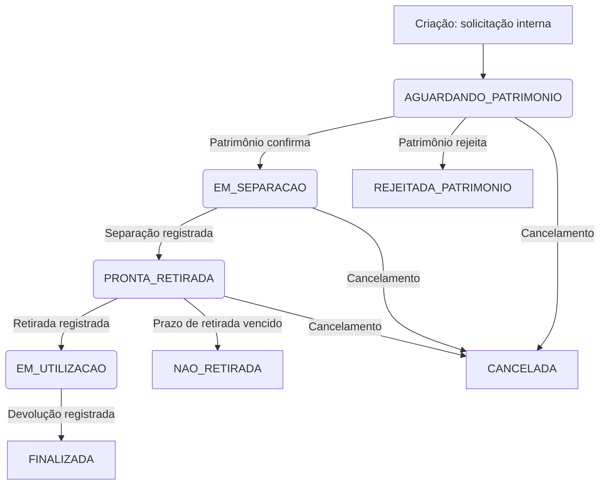
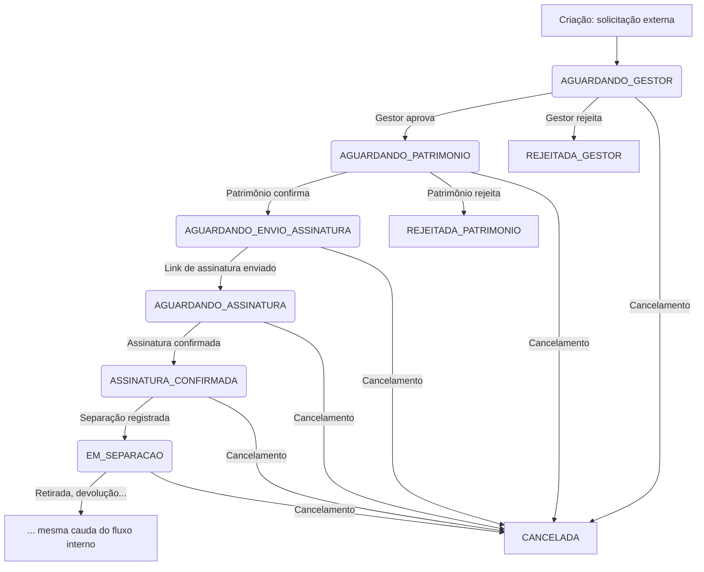
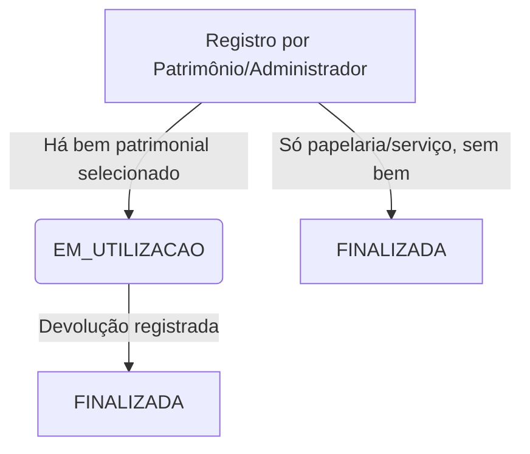
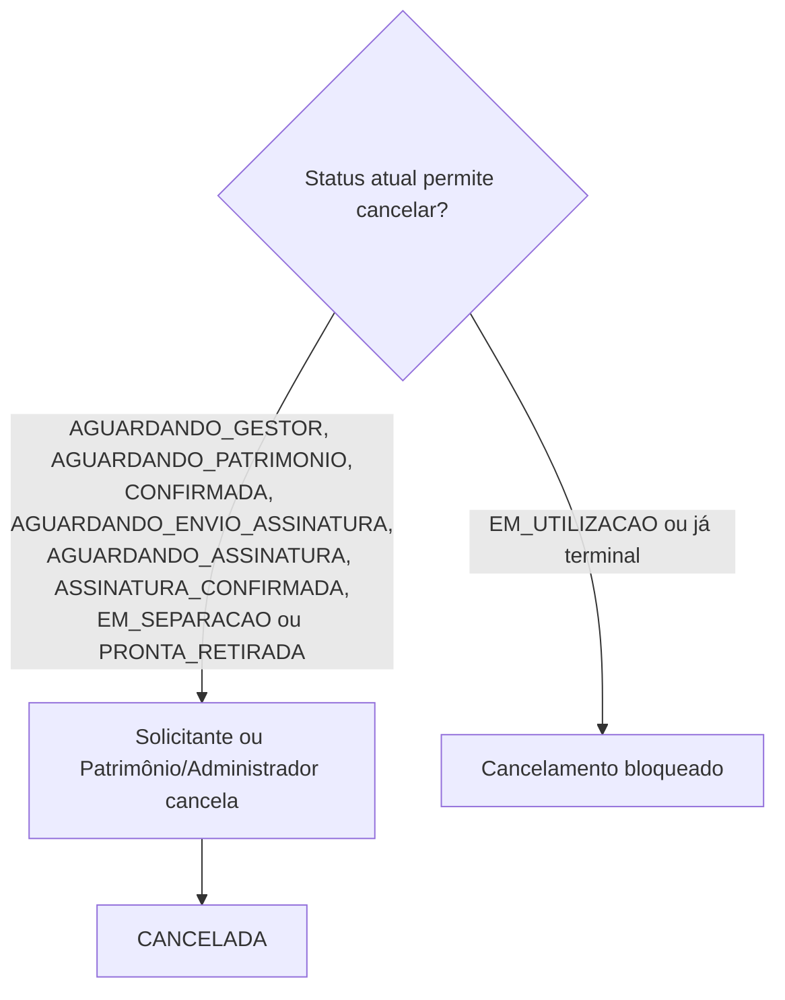
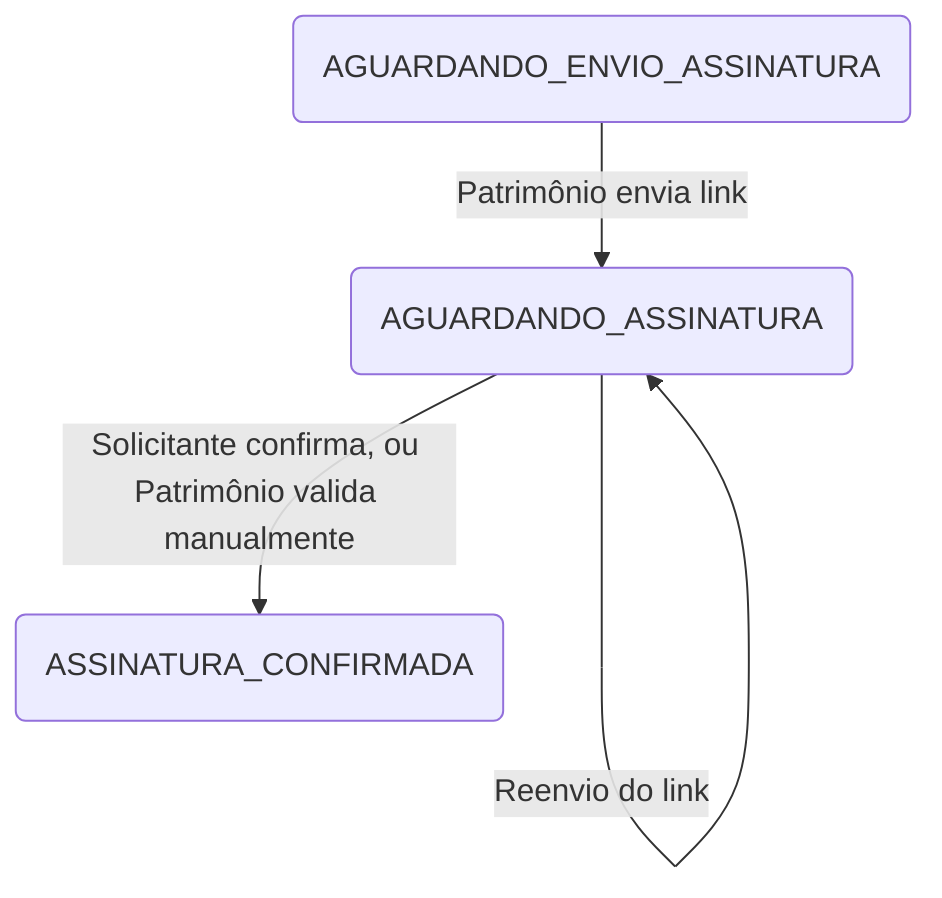
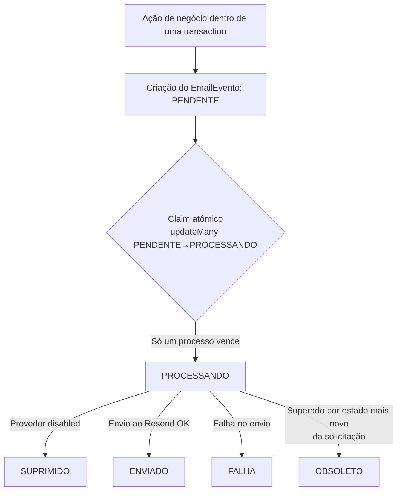

# Fluxos — Fluxo Patrimonial

[← Documentação](README.md)

Diagramas baseados exclusivamente nos estados e transições reais de `src/lib/status.ts` (`TRANSICOES_PERMITIDAS`) e nas rotas de `src/app/api/solicitacoes/**`. Estados entre parênteses são terminais.

## Fluxo interno

Sem gestor, sem etapa de assinatura. Campo Ambiente obrigatório na criação.

## Fluxo externo

A partir de `EM_SEPARACAO`, o restante (`PRONTA_RETIRADA` → `EM_UTILIZACAO` → `FINALIZADA`, ou `NAO_RETIRADA`) é idêntico ao fluxo interno.

## Atendimento imediato

Sem gestor, sem aprovação prévia, sem cálculo de prazo/antecedência (`prazoHoras`/`antecedenciaMinutos`/`dentroDoPrazo` ficam `null`). Sempre tratado como `tipoEmprestimo: 'interno'` no banco, independente do que for enviado.

## Cancelamento

Não é possível cancelar a partir de `EM_UTILIZACAO` (só resta o caminho de devolução).

## Assinatura (detalhe do fluxo externo)

Não há integração automática com sistema externo de assinatura eletrônica — a confirmação é sempre uma ação manual dentro do sistema.

## Fluxo de e-mails (visão de outbox)

A criação do `EmailEvento` (estado `PENDENTE`) é sempre parte da mesma transaction da ação de negócio que o originou — o envio efetivo (claim → `PROCESSANDO` → resultado) acontece depois, de forma assíncrona/desacoplada, sem poder desfazer a ação de negócio já commitada. Ver `docs/EMAILS.md` para o detalhamento completo de idempotência e retry.
